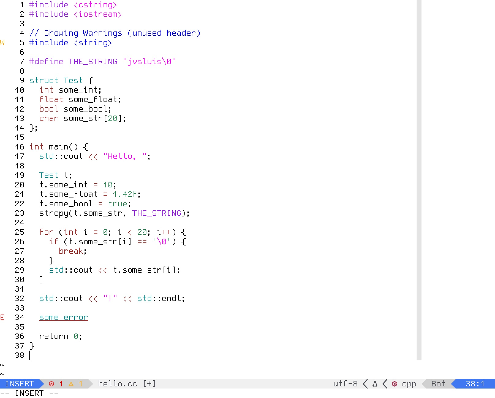

# gedit.nvim
An nvim color scheme based on the original gedit classic light theme.

### Installation:

Using [vim-plug](https://github.com/junegunn/vim-plug):
```Plug 'jvsluis/gedit-nvim-theme'```

Using [lazy.nvim](https://github.com/folke/lazy.nvim):
```{ "jvsluis/gedit-nvim-theme" }```

### Usage
Set your color scheme with the following command:
```colorscheme gedit```

Or place this in your init.lua:
```vim.cmd('colorscheme gedit')```

### Screenshot:


The font I'm using is Gohu Mono Nerd Font.


